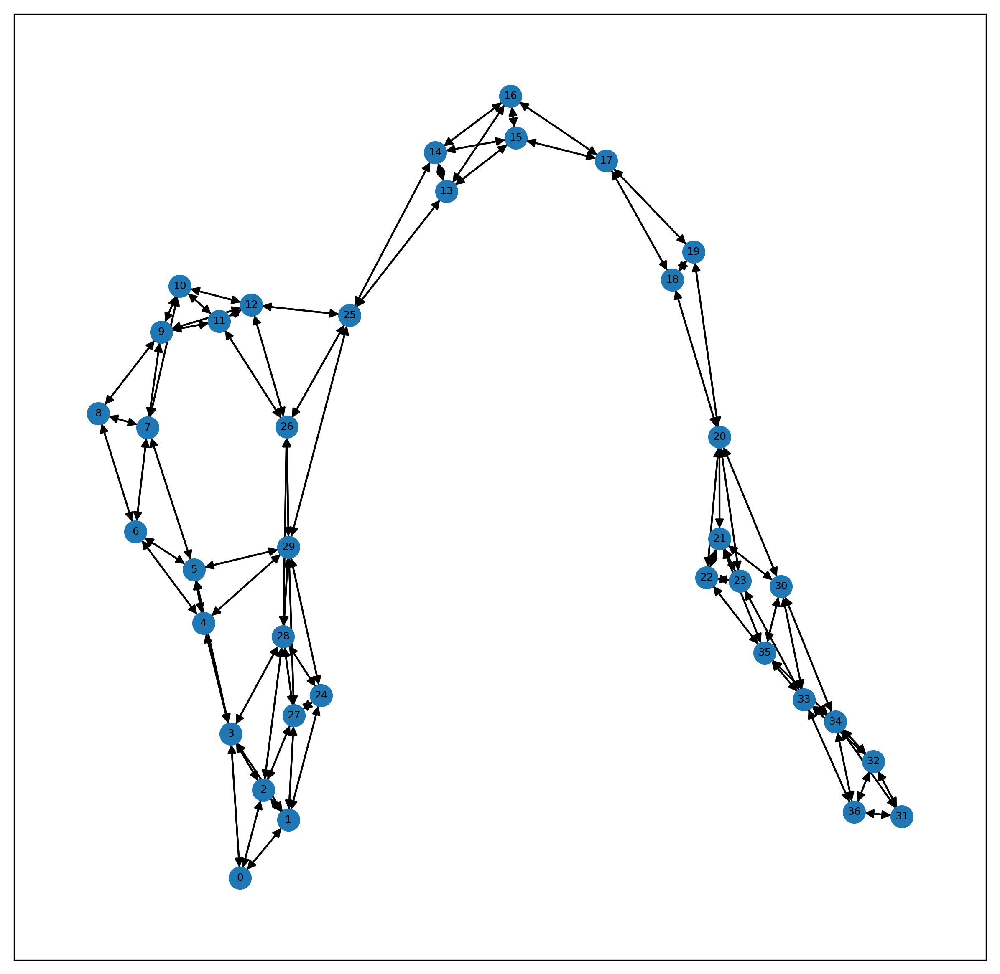

```python
import torch
import torch.nn.functional as F
from torch_geometric.nn import GCNConv
from torch_geometric.datasets import Planetoid
from torch_geometric.datasets import TUDataset
import networkx as nx
import torch_geometric
import matplotlib.pyplot as plt
from torch_geometric.data import DataLoader
import torch_geometric.nn as pyg_nn
import numpy as np
```

# 1.加载数据并理解数据集


```python
# 加载Cora数据集.(自动帮你下载)
dataset = TUDataset(root='C:/Users/MI/Desktop/GCN/', name='ENZYMES')
dataset
```

    Downloading https://www.chrsmrrs.com/graphkerneldatasets/ENZYMES.zip
    Extracting C:\Users\MI\Desktop\GCN\ENZYMES\ENZYMES.zip
    Processing...
    Done!
    


    ENZYMES(600)


```python
dataset.num_features
```


    3


```python
dataset.num_classes
```


    6


```python
print(len(dataset))
data = dataset[0]
data
# edge_index代表的是边矩阵，是2行，74564列。x是特征矩阵，19580行，3列，说明有19580个node，y是标签。
```

    600
    


    Data(edge_index=[2, 168], x=[37, 3], y=[1])


```python
# Node feature matrix with shape [num_nodes, num_node_features]
print(data.x)
print(data.x.shape)
```

    tensor([[1., 0., 0.],
            [1., 0., 0.],
            [1., 0., 0.],
            [1., 0., 0.],
            [1., 0., 0.],
            [1., 0., 0.],
            [1., 0., 0.],
            [1., 0., 0.],
            [1., 0., 0.],
            [1., 0., 0.],
            [1., 0., 0.],
            [1., 0., 0.],
            [1., 0., 0.],
            [1., 0., 0.],
            [1., 0., 0.],
            [1., 0., 0.],
            [1., 0., 0.],
            [1., 0., 0.],
            [1., 0., 0.],
            [1., 0., 0.],
            [1., 0., 0.],
            [1., 0., 0.],
            [1., 0., 0.],
            [1., 0., 0.],
            [0., 1., 0.],
            [0., 1., 0.],
            [0., 1., 0.],
            [0., 1., 0.],
            [0., 1., 0.],
            [0., 1., 0.],
            [0., 1., 0.],
            [0., 1., 0.],
            [0., 1., 0.],
            [0., 1., 0.],
            [0., 1., 0.],
            [0., 1., 0.],
            [0., 1., 0.]])
    torch.Size([37, 3])
    


```python
# Graph connectivity in COO format with shape [2, num_edges] and type torch.long
data.edge_index
```


    tensor([[ 0,  0,  0,  1,  1,  1,  1,  1,  2,  2,  2,  2,  2,  3,  3,  3,  3,  3,
              3,  4,  4,  4,  4,  5,  5,  5,  5,  5,  6,  6,  6,  6,  7,  7,  7,  7,
              7,  8,  8,  8,  9,  9,  9,  9,  9, 10, 10, 10, 10, 11, 11, 11, 11, 12,
             12, 12, 12, 12, 13, 13, 13, 13, 14, 14, 14, 14, 15, 15, 15, 15, 16, 16,
             16, 16, 17, 17, 17, 17, 18, 18, 18, 19, 19, 19, 20, 20, 20, 20, 20, 20,
             21, 21, 21, 21, 21, 22, 22, 22, 22, 23, 23, 23, 23, 24, 24, 24, 24, 25,
             25, 25, 25, 25, 26, 26, 26, 26, 26, 27, 27, 27, 27, 27, 28, 28, 28, 28,
             28, 28, 29, 29, 29, 29, 29, 29, 29, 30, 30, 30, 30, 30, 31, 31, 31, 32,
             32, 32, 32, 33, 33, 33, 33, 33, 33, 34, 34, 34, 34, 34, 34, 35, 35, 35,
             35, 35, 36, 36, 36, 36],
            [ 1,  2,  3,  0,  2,  3, 24, 27,  0,  1,  3, 27, 28,  0,  1,  2,  4,  5,
             28,  3,  5,  6, 29,  3,  4,  6,  7, 29,  4,  5,  7,  8,  5,  6,  8,  9,
             10,  6,  7,  9,  7,  8, 10, 11, 12,  7,  9, 11, 12,  9, 10, 12, 26,  9,
             10, 11, 25, 26, 14, 15, 16, 25, 13, 15, 16, 25, 13, 14, 16, 17, 13, 14,
             15, 17, 15, 16, 18, 19, 17, 19, 20, 17, 18, 20, 18, 19, 21, 22, 23, 30,
             20, 22, 23, 30, 35, 20, 21, 23, 35, 20, 21, 22, 33,  1, 27, 28, 29, 12,
             13, 14, 26, 29, 11, 12, 25, 28, 29,  1,  2, 24, 28, 29,  2,  3, 24, 26,
             27, 29,  4,  5, 24, 25, 26, 27, 28, 20, 21, 33, 34, 35, 32, 34, 36, 31,
             33, 34, 36, 23, 30, 32, 34, 35, 36, 30, 31, 32, 33, 35, 36, 21, 22, 30,
             33, 34, 31, 32, 33, 34]])


```python
# Edge feature matrix with shape [num_edges, num_edge_features]
# 这个是边的属性矩阵，类比点的属性矩阵
print(data.edge_attr)
```

    None
    


```python
# Target to train against (may have arbitrary shape), 
# e.g., node-level targets of shape [num_nodes, *] or graph-level targets of shape [1, *]
print(data.y)
print(len(data.y))
```

    tensor([5])
    1
    


```python
# Node position matrix with shape [num_nodes, num_dimensions]
print(data.pos)
```

    None
    

None of these attributes is required. In fact, the Data object is not even restricted to these attributes. We can, e.g., extend it by data.face to save the connectivity of triangles from a 3D mesh in a tensor with shape [3, num_faces] and type torch.long.


```python
edge,x,y = data  # 得到edge，node矩阵和y即label
print(edge,x,y)
numpyx = x[1].numpy()
numpyy = y[1].numpy()
numpyedge = edge[1].numpy()
```

    ('edge_index', tensor([[ 0,  0,  0,  1,  1,  1,  1,  1,  2,  2,  2,  2,  2,  3,  3,  3,  3,  3,
              3,  4,  4,  4,  4,  5,  5,  5,  5,  5,  6,  6,  6,  6,  7,  7,  7,  7,
              7,  8,  8,  8,  9,  9,  9,  9,  9, 10, 10, 10, 10, 11, 11, 11, 11, 12,
             12, 12, 12, 12, 13, 13, 13, 13, 14, 14, 14, 14, 15, 15, 15, 15, 16, 16,
             16, 16, 17, 17, 17, 17, 18, 18, 18, 19, 19, 19, 20, 20, 20, 20, 20, 20,
             21, 21, 21, 21, 21, 22, 22, 22, 22, 23, 23, 23, 23, 24, 24, 24, 24, 25,
             25, 25, 25, 25, 26, 26, 26, 26, 26, 27, 27, 27, 27, 27, 28, 28, 28, 28,
             28, 28, 29, 29, 29, 29, 29, 29, 29, 30, 30, 30, 30, 30, 31, 31, 31, 32,
             32, 32, 32, 33, 33, 33, 33, 33, 33, 34, 34, 34, 34, 34, 34, 35, 35, 35,
             35, 35, 36, 36, 36, 36],
            [ 1,  2,  3,  0,  2,  3, 24, 27,  0,  1,  3, 27, 28,  0,  1,  2,  4,  5,
             28,  3,  5,  6, 29,  3,  4,  6,  7, 29,  4,  5,  7,  8,  5,  6,  8,  9,
             10,  6,  7,  9,  7,  8, 10, 11, 12,  7,  9, 11, 12,  9, 10, 12, 26,  9,
             10, 11, 25, 26, 14, 15, 16, 25, 13, 15, 16, 25, 13, 14, 16, 17, 13, 14,
             15, 17, 15, 16, 18, 19, 17, 19, 20, 17, 18, 20, 18, 19, 21, 22, 23, 30,
             20, 22, 23, 30, 35, 20, 21, 23, 35, 20, 21, 22, 33,  1, 27, 28, 29, 12,
             13, 14, 26, 29, 11, 12, 25, 28, 29,  1,  2, 24, 28, 29,  2,  3, 24, 26,
             27, 29,  4,  5, 24, 25, 26, 27, 28, 20, 21, 33, 34, 35, 32, 34, 36, 31,
             33, 34, 36, 23, 30, 32, 34, 35, 36, 30, 31, 32, 33, 35, 36, 21, 22, 30,
             33, 34, 31, 32, 33, 34]])) ('x', tensor([[1., 0., 0.],
            [1., 0., 0.],
            [1., 0., 0.],
            [1., 0., 0.],
            [1., 0., 0.],
            [1., 0., 0.],
            [1., 0., 0.],
            [1., 0., 0.],
            [1., 0., 0.],
            [1., 0., 0.],
            [1., 0., 0.],
            [1., 0., 0.],
            [1., 0., 0.],
            [1., 0., 0.],
            [1., 0., 0.],
            [1., 0., 0.],
            [1., 0., 0.],
            [1., 0., 0.],
            [1., 0., 0.],
            [1., 0., 0.],
            [1., 0., 0.],
            [1., 0., 0.],
            [1., 0., 0.],
            [1., 0., 0.],
            [0., 1., 0.],
            [0., 1., 0.],
            [0., 1., 0.],
            [0., 1., 0.],
            [0., 1., 0.],
            [0., 1., 0.],
            [0., 1., 0.],
            [0., 1., 0.],
            [0., 1., 0.],
            [0., 1., 0.],
            [0., 1., 0.],
            [0., 1., 0.],
            [0., 1., 0.]])) ('y', tensor([5]))
    


```python
# 将整个数据集可视化出来
g = nx.DiGraph() # 建一个空的有向图
name,edgeinfo = edge
src = edgeinfo[0].numpy()
dst = edgeinfo[1].numpy()
edgelist = zip(src,dst)
for i,j in edgelist:
    g.add_edge(i,j) 
plt.rcParams['figure.dpi'] = 300 #分辨率
fig , ax1 = plt.subplots(figsize=(10,10))
nx.draw_networkx(g , ax = ax1 , font_size=6 , node_size = 150)
plt.show()
```





```python
print(len(g.nodes))
g.nodes
```

    37
    


    NodeView((0, 1, 2, 3, 24, 27, 28, 4, 5, 6, 29, 7, 8, 9, 10, 11, 12, 26, 25, 13, 14, 15, 16, 17, 18, 19, 20, 21, 22, 23, 30, 35, 33, 34, 31, 32, 36))


# 2.构建GCN模型，以及训练和测试


```python
dataset = dataset.shuffle()
train_dataset = dataset[:540]
test_dataset = dataset[540:]
len(train_dataset), len(test_dataset)
```


    (540, 60)


```python
class Net(torch.nn.Module):
    def __init__(self):
        super(Net, self).__init__()
        self.conv1 = GCNConv(3, 16)
        self.conv2 = GCNConv(16, 6)

    def forward(self, data):
        x, edge_index, batch = data.x, data.edge_index, data.batch
        x = self.conv1(x, edge_index)
        x = F.relu(x)
        x = F.dropout(x, training=self.training)
        x = self.conv2(x, edge_index)
#         print(x.shape)
        x = pyg_nn.global_max_pool(x, batch)
#         print(x.shape)
        return F.log_softmax(x, dim=1)
```


```python
# 训练
def train():
    model.train()
    loss_all = 0
    for data in train_loader:
        data = data.to(device)
        optimizer.zero_grad()
        output = model(data)
#         print(output.shape)
        label = data.y.to(device)
        loss = loss_f(output, label)
        loss.backward()
        loss_all += loss.item()
        optimizer.step()
        
    return (loss_all / len(train_dataset))
    
device = torch.device('cuda' if torch.cuda.is_available() else 'cpu')
model = Net().to(device)
optimizer = torch.optim.Adam(model.parameters(), lr=0.005)
loss_f = torch.nn.CrossEntropyLoss()
train_loader = DataLoader(train_dataset, batch_size=10, shuffle=False)
for epoch in range(100):
    tmp = train()
    if epoch % 20 == 0:
        print(tmp) 
```

    0.18143129525361237
    0.1748289077370255
    0.17250474073268748
    0.1729406502511766
    0.17272627706880922
    


```python
# 测试
from  sklearn.metrics import accuracy_score
def evaluate(loader):
    model.eval()
    with torch.no_grad():
        for data in loader:
            data = data.to(device)
            pred = model(data).detach().numpy()
            label = data.y.detach().numpy()        
    return pred , label

loader = DataLoader(test_dataset, batch_size=60, shuffle=False)
pred , label = evaluate(loader)
print(pred.shape , label.shape)
```

    (60, 6) (60,)
    


```python
preds = []
# list_a.index(max(list_a)) 
for i in range(pred.shape[0]):
    tmp = pred[i].tolist()
    preds.append(tmp.index(max(tmp)))
len(preds)
```


    60


```python
accuracy_score(label, preds)
```


    0.2833333333333333


